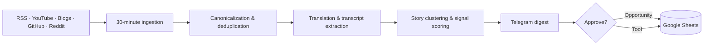

<div align="center">

# ⚡ SIGNAL

### Your personal information firewall — signal over noise.

[](https://dotnet.microsoft.com/)
[](https://learn.microsoft.com/aspnet/core)
[](docker-compose.yml)
[](LICENSE)

**An open-source intelligence and opportunity platform that monitors the global tech ecosystem, verifies what matters, and delivers a focused digest through Telegram.**

[✨ Features](#-what-signal-does) · [🚀 Quick start](#-quick-start) · [🤖 Bot commands](#-telegram-bot) · [🏗️ Architecture](#️-how-it-works) · [🗺️ Roadmap](#️-what-is-next)

</div>

---

## 🎯 What Signal does

Signal turns a noisy stream of AI, developer, and technology updates into useful, verified actions:

| Capability | What you get |
|---|---|
| 🌍 **Global ingestion** | RSS, YouTube, blogs, GitHub, Reddit, and international sources monitored every 30 minutes |
| 🧠 **Signal scoring** | Relevance, quality, trust, deduplication, and cross-source story consolidation |
| 🌐 **English-first digest** | Chinese, Japanese, Korean, Russian, and Arabic sources translated through free fallback engines |
| 🛡️ **Link verification** | Transcript and claim checks for YouTube, Instagram Reels, and articles, including scam indicators |
| 🧰 **Developer discovery** | GitHub repositories, open-source tools, API credits, free tiers, and useful offers extracted automatically |
| 📌 **Personal library** | Approve and save opportunities or tools directly to Google Sheets |
| 💸 **$0/month friendly** | SQLite, Docker, local AI/Ollama, free translation tiers, and optional free hosting |

## ⚡ Quick start

### Prerequisites

- [.NET 10 SDK](https://dotnet.microsoft.com/download/dotnet/10.0)
- Git — or Docker and Docker Compose
- Optional: Telegram bot token and Google Sheets Apps Script URL

### Run locally

```bash
git clone https://github.com/shivadha/signal.git
cd signal
cp .env.example .env

dotnet restore
dotnet build
dotnet test

dotnet run --project src/Signal.Api
```

The API, worker, webhook, and Telegram polling are hosted together. Health check:

```bash
curl http://localhost:8080/health
```

### Run with Docker

```bash
docker compose up -d
# Follow logs
docker compose logs -f
```

> 🔐 **Keep secrets out of Git.** Configure `.env` locally and never commit bot tokens, chat IDs, or deployment URLs.

## 🤖 Telegram bot

Signal is designed around fast, interactive Telegram cards and approval buttons:

| Command | Experience |
|---|---|
| `/today` | Topic-separated daily digest with images and context |
| `/offers` | AI credits, cloud grants, discounts, and free tiers |
| `/tools` | Open-source tools, CLI utilities, and GitHub projects |
| `/global` | International AI releases translated into English |
| `/verify <url>` | Check a video, reel, or article for legitimacy and risk |
| `/transcript <url>` | Extract a timestamped transcript or script |
| `/saved` | Browse your approved personal library |

Set `TELEGRAM_BOT_TOKEN` and `TELEGRAM_CHAT_ID` in `.env`, then start the app. See the [Telegram setup guide](#-telegram-setup) for details.

## 🏗️ How it works



The solution is organized around focused .NET projects under [`src/`](src/):

```text
sources → ingestion → normalization → scoring → Telegram cards → saved library
```

## 🧩 Configuration

Copy `.env.example` to `.env` and configure only the integrations you need:

```env
AI_PROVIDER=none
TELEGRAM_BOT_TOKEN=your_bot_token_here
TELEGRAM_CHAT_ID=your_chat_id_here
GOOGLE_SHEETS_ENABLED=false
GOOGLE_APPS_SCRIPT_URL=
```

Signal works without a paid AI provider using heuristics, trust weighting, and fuzzy matching. You can optionally connect Ollama, Groq, or Gemini later.

## 📊 Google Sheets sync

To save approved items into two tabs:

1. Create `Opportunities` and `Tools` tabs in a Google Sheet.
2. Copy [`deploy/google-apps-script.js`](deploy/google-apps-script.js) into Apps Script.
3. Deploy it as a Web App with access set to **Anyone**.
4. Set `GOOGLE_SHEETS_ENABLED=true` and `GOOGLE_APPS_SCRIPT_URL` in `.env`.
5. Use the approval buttons in Telegram.

Read the full [free deployment guide](docs/free-deployment-guide.md) for Render, Koyeb, Fly.io, and Windows Runner options.

## 🗺️ What is next

- [x] Clean Architecture foundation, Docker, tests, and SQLite
- [x] RSS ingestion, Telegram controls, scoring, verification, and story engine
- [x] YouTube ingestion, transcripts, translation, and GitHub extraction
- [x] Google Sheets gateway with resilient offline queue
- [x] Autonomous 30-minute scheduling
- [ ] More source connectors and configurable user preferences
- [ ] Web dashboard for browsing and searching the signal archive
- [ ] Observability dashboard and richer evaluation metrics

## 🛠️ Contributing

Contributions, source suggestions, bug reports, and new verification rules are welcome. Please open an issue first for larger changes, then submit a pull request against `main`.

```bash
dotnet format
dotnet test
```

## 📄 License

Released under the [MIT License](LICENSE).

<div align="center">

**Built to help builders spend less time searching and more time shipping.**

[⬆ Back to top](#-signal)

</div>
