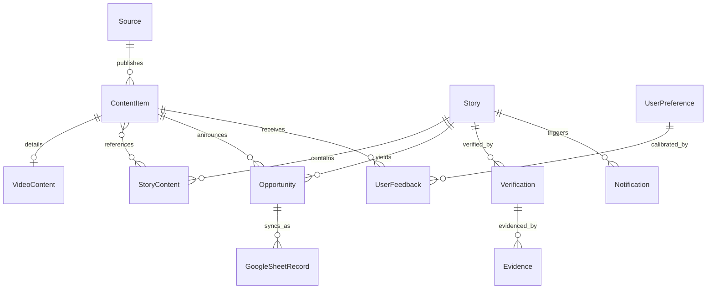

# SIGNAL — Database Domain Model & Schema Specification

The persistence layer is managed via **Entity Framework Core 10** targeting **SQLite** for lightweight, self-contained, zero-cost single-node deployment, designed with portability to **PostgreSQL** via EF Core provider abstractions.

---

## 1. Entity Relational Diagram

---

## 2. Core Entity Definitions

### 2.1 Source
Tracks upstream publishers, feed addresses, and trust provenance.
- `Id` (Guid, PK)
- `Name` (string, max 150)
- `Url` (string, max 500)
- `FeedUrl` (string, max 500, nullable)
- `SourceType` (enum: `Rss`, `OfficialBlog`, `YouTubeChannel`, `Reddit`, `TelegramChannel`, `Social`)
- `Category` (string, max 100)
- `TrustTier` (int: 1 = Official/Primary, 2 = Established Secondary, 3 = Specialist, 4 = Community, 5 = Unknown)
- `IsOfficial` (bool)
- `IsActive` (bool)
- `Language` (string, max 10, default "en")
- `Country` (string, max 10, nullable)
- `LastFetchedAt` (DateTimeOffset, nullable)
- `CreatedAt` (DateTimeOffset)
- `UpdatedAt` (DateTimeOffset)

### 2.2 ContentItem
Normalized representation of individual ingested posts, videos, or articles.
- `Id` (Guid, PK)
- `SourceId` (Guid, FK -> Source.Id)
- `Platform` (string, max 50, e.g. "YouTube", "Blog", "Reddit", "RSS")
- `Title` (string, max 500)
- `Url` (string, max 1000)
- `CanonicalUrl` (string, max 1000, indexed)
- `Author` (string, max 150, nullable)
- `PublishedAt` (DateTimeOffset)
- `DiscoveredAt` (DateTimeOffset)
- `ContentHash` (string, max 64, SHA-256 indexed)
- `TextContent` (string, nullable)
- `Language` (string, max 10)
- `Category` (string, max 100, nullable)
- `Summary` (string, max 2000, nullable)
- `IsDuplicate` (bool, default false)
- `DuplicateOfId` (Guid, nullable, FK -> ContentItem.Id)
- `CreatedAt` (DateTimeOffset)
- `UpdatedAt` (DateTimeOffset)

### 2.3 VideoContent
Enriched metadata specifically for video platforms (YouTube, Shorts, etc.).
- `Id` (Guid, PK)
- `ContentItemId` (Guid, FK -> ContentItem.Id, Unique)
- `Platform` (string, max 50)
- `VideoId` (string, max 100, indexed)
- `ChannelId` (string, max 100, nullable)
- `ChannelName` (string, max 200, nullable)
- `Title` (string, max 500)
- `Description` (string, nullable)
- `Duration` (TimeSpan, nullable)
- `ThumbnailUrl` (string, max 1000, nullable)
- `PublishedAt` (DateTimeOffset)
- `Transcript` (string, nullable)
- `TranscriptAvailable` (bool, default false)
- `CaptionLanguage` (string, max 10, nullable)
- `ViewCount` (long, default 0)
- `LikeCount` (long, default 0)
- `CommentCount` (long, default 0)
- `CreatedAt` (DateTimeOffset)
- `UpdatedAt` (DateTimeOffset)

### 2.4 Story
First-class cluster representing the actual underlying event across all platforms.
- `Id` (Guid, PK)
- `CanonicalTopic` (string, max 250, indexed)
- `Title` (string, max 500)
- `Summary` (string, nullable)
- `Category` (string, max 100)
- `FirstDetectedAt` (DateTimeOffset)
- `LastUpdatedAt` (DateTimeOffset)
- `ImportanceScore` (double, 0.0 - 1.0)
- `RelevanceScore` (double, 0.0 - 1.0)
- `EvidenceScore` (double, 0.0 - 1.0)
- `FreshnessScore` (double, 0.0 - 1.0)
- `VerificationStatus` (enum: `Unverified`, `PartiallyVerified`, `Verified`, `Contradicted`, `Expired`, `Unknown`)
- `Status` (enum: `Active`, `Archived`, `Suppressed`)
- `CreatedAt` (DateTimeOffset)
- `UpdatedAt` (DateTimeOffset)

### 2.5 StoryContent
Join entity linking individual content items to their overarching story cluster.
- `Id` (Guid, PK)
- `StoryId` (Guid, FK -> Story.Id)
- `ContentItemId` (Guid, FK -> ContentItem.Id)
- `Platform` (string, max 50)
- `RelationshipType` (enum: `Primary`, `Coverage`, `Commentary`, `Repost`, `Duplicate`, `Related`, `Contradictory`)
- `SimilarityScore` (double, 0.0 - 1.0)
- `CreatedAt` (DateTimeOffset)

### 2.6 Opportunity
Tracked free tiers, cloud credits, tool releases, or discounts.
- `Id` (Guid, PK)
- `ContentItemId` (Guid, nullable, FK -> ContentItem.Id)
- `StoryId` (Guid, nullable, FK -> Story.Id)
- `Title` (string, max 500)
- `Description` (string, nullable)
- `OpportunityType` (enum: `FreeTool`, `FreeSubscription`, `FreeTrial`, `FreeApiCredits`, `FreeCloudCredits`, `DeveloperProgram`, `StudentProgram`, `FreeCourse`, `Discount`, `LimitedTimeOffer`, `NewFreeTier`, `OpenSourceRelease`, `Other`)
- `Value` (string, max 100, nullable)
- `Currency` (string, max 10, nullable)
- `IsFree` (bool, default true)
- `Eligibility` (string, max 500, nullable)
- `Country` (string, max 100, nullable)
- `StartDate` (DateTimeOffset, nullable)
- `ExpiryDate` (DateTimeOffset, nullable, indexed)
- `ClaimMethod` (string, nullable)
- `OfficialSourceUrl` (string, max 1000, nullable)
- `VerificationStatus` (enum: `Discovered`, `PartiallyVerified`, `Verified`, `Contradicted`, `Expired`, `Unknown`)
- `VerificationScore` (double, 0.0 - 1.0)
- `RelevanceScore` (double, 0.0 - 1.0)
- `UrgencyScore` (double, 0.0 - 1.0)
- `Status` (enum: `Discovered`, `PendingReview`, `Approved`, `Rejected`, `Saved`, `Claimed`, `Expired`, `Archived`)
- `LastVerifiedAt` (DateTimeOffset, nullable)
- `CreatedAt` (DateTimeOffset)
- `UpdatedAt` (DateTimeOffset)

### 2.7 GoogleSheetRecord
State machine for resilient offline-capable approval tracking.
- `Id` (Guid, PK)
- `OpportunityId` (Guid, nullable, FK -> Opportunity.Id)
- `StoryId` (Guid, nullable, FK -> Story.Id)
- `RowIndex` (int, nullable)
- `SheetName` (string, max 100)
- `PayloadJson` (string)
- `Status` (enum: `PendingSync`, `Synced`, `Failed`, `Skipped`)
- `ErrorMessage` (string, nullable)
- `RetryCount` (int, default 0)
- `SyncedAt` (DateTimeOffset, nullable)
- `CreatedAt` (DateTimeOffset)
- `UpdatedAt` (DateTimeOffset)

### 2.8 UserPreference & UserFeedback
Controls personalization and dynamic score calibration.
- `UserPreference`: `Key`, `Weight` (1-10), `Category`, `UpdatedAt`
- `UserFeedback`: `Id`, `ContentItemId`, `StoryId`, `FeedbackType` (`Useful`, `NotUseful`, `Saved`, `MuteSource`, `MuteTopic`), `CreatedAt`
