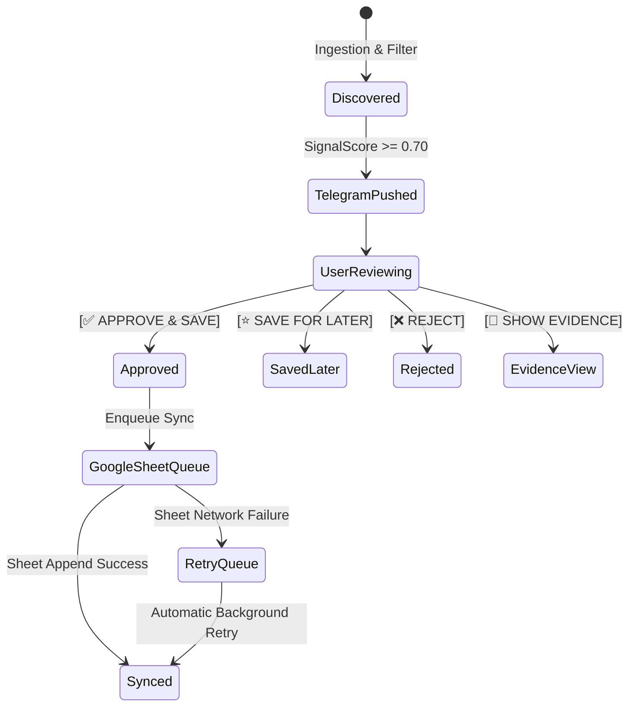

# SIGNAL — Telegram Bot Interface & Interactive Workflows

The Telegram Bot serves as the primary daily interface for Signal V1. It enforces the core rule: **The system presents discoveries; ONLY explicit user approval persists opportunities to Google Sheets.**

---

## 1. Bot Command Specification

| Command | Description |
|---|---|
| `/start` | Initializes chat session, confirms Telegram Chat ID authorization. |
| `/today` | Generates on-demand digest of high-signal items discovered in the last 24h. |
| `/offers` | Displays active, verified developer opportunities and free credits. |
| `/ai` | Displays major validated AI model and architecture releases. |
| `/tools` | Shows newly discovered developer platforms, SDKs, and CLI utilities. |
| `/learning` | Lists high-density courses, tutorials, and research papers. |
| `/videos` | Shows clustered video recommendations (highest information density only). |
| `/saved` | Lists items currently saved in personal library. |
| `/digest` | Triggers summary breakdown (categorized signal vs. filtered noise counts). |
| `/settings` | Toggles notification urgency thresholds, digest schedules, and topic weights. |
| `/check <url>` | Evaluates any submitted link for duplication, freshness, and claim credibility. |
| `/help` | Displays command syntax and operational hints. |

---

## 2. Interactive Telegram Opportunity Card

When an opportunity exceeds the minimum Signal threshold, the bot pushes an interactive Markdown card:

```text
💰 FREE AI OPPORTUNITY

GitHub Copilot — Free Access

Value: $10/month
Eligibility: Active OSS contributors & students
Expires: 31 Dec 2026

Verification: 🟢 Official Source (github.blog)
Relevance: 🔥 HIGH (9.5/10)

Why you should care:
Directly improves .NET & Python coding productivity with zero subscription cost.

[ 🔗 Official Source ]
[ ✅ APPROVE & SAVE ]  [ ⭐ SAVE FOR LATER ]
[ ❌ REJECT ]          [ 🔎 SHOW EVIDENCE ]
```

---

## 3. Callback State Machine & Actions



### Action Behaviors:
- **`[✅ APPROVE & SAVE]`**: Updates local record status to `Approved`. Triggers `GoogleSheetApprovalService`. Appends full structured record to user's Google Sheet. Edits message with confirmation timestamp and sheet row index (`✅ SAVED #142`).
- **`[⭐ SAVE FOR LATER]`**: Marks record as `Saved`. Accessible via `/saved`. Does not write to Google Sheets.
- **`[❌ REJECT]`**: Marks record as `Rejected`. Calibrates negative feedback weight for similar future claims.
- **`[🔎 SHOW EVIDENCE]`**: Expands message with source quotation, official announcement URL, and verification confidence metrics.

---

## 4. User-Submitted Link Handling (`/check <url>`)

Users can forward or send any URL directly to the bot. Signal evaluates:
1. Exact & Canonical URL match.
2. Story cluster association.
3. Content freshness (has new info emerged since the story was first recorded?).
4. Clickbait / Ragebait penalty.

**Sample Bot Response:**
```text
🔎 SIGNAL ANALYSIS

Topic: OpenAI Swarm Multi-Agent Framework
Relevance: HIGH (9.2/10)
Verification: VERIFIED (Official repo)
Status: Already seen 2 days ago
New Information: None (Duplicate commentary)
Recommendation: No notification required.
```
